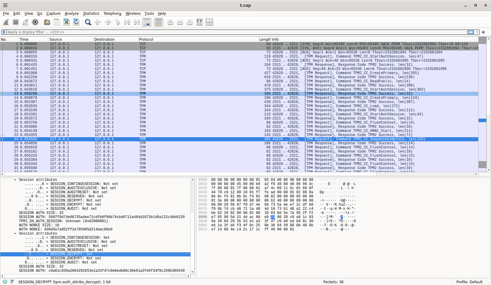

## TPM based Key Deriviation Function (KDF)


CLI and library which provides a `counter mode KDF` as described in [NIST SP 800-108](https://csrc.nist.gov/pubs/sp/800/108/r1/upd1/final).

This CLI utilizes an TPM-based HMAC key as a basis to derive the KDF.

Library basically overrides hashicorp's  [Vault's KDF](https://pkg.go.dev/github.com/hashicorp/vault/sdk/helper/kdf)

---

#### References

* [Trusted Platform Module (TPM) recipes with tpm2_tools and go-tpm](https://github.com/salrashid123/tpm2)
* [golang-jwt for Trusted Platform Module (TPM)](https://github.com/salrashid123/golang-jwt-tpm)
* [tpm2 key utility](https://github.com/salrashid123/tpm2genkey)
* [ASN1 format for TPM keys](https://github.com/salrashid123/tpm2/tree/master/tpm-key)

---

### Library

As a library, you need to import Vault's base KDF class and override it with this libarary.

The following with derive a key from "foo":

```golang
import (
	"encoding/hex"
	"github.com/hashicorp/vault/sdk/helper/kdf"
	tkdf "github.com/salrashid123/tpm-kdf/hmac"
)

	keyFileBytes, err := os.ReadFile("/path/to/tpm-key.pem")
	b := []byte("foo")

	rc, err := kdf.CounterMode(func(key []byte, data []byte) ([]byte, error) {
		return tkdf.TPMHMAC("/dev/tpmrm0", nil, keyFileBytes, nil, nil, "", data)
	}, prfLen, nil, b, 256)

	fmt.Printf("KDF %s\n", hex.EncodeToString(rc))
```

The core accepts the following parameters:

```golang
func TPMKDF(
	tpmPath string, 
	rwc io.ReadWriteCloser, 
	pemkeyBytes []byte, 
	parentAuth []byte, 
	keyAuth []byte,
	sessionEncryptionName string,
	data []byte) (*tpmPrf, error) {
```

if you want the library to open and close the tpm for every call, specify the `tpmPath` (eg `tpmPath=/dev/tpmrm0`)

if you want to manage the TPM read closer externally, set `tpmPath` nil and set the `rwc` to a TPM

```golang
	rwc, err := tkdf.OpenTPM(*tpmPath)
	defer func() {
		rwc.Close()
	}()

	b := []byte("foo")

	rc, err := kdf.CounterMode(func(key []byte, data []byte) ([]byte, error) {
		return tkdf.TPMHMAC("", rwc, keyFileBytes, nil, nil, "", data)
	}, prfLen, nil, b, 256)

	fmt.Printf("KDF %s\n", hex.EncodeToString(rc))

```

### CLI

As a library, provide the PEM formatted TPM private key and the length of of the data to mac.

You can get the signed and attested binary on the `Releases` page

```bash
./tpm-kdf  --data=foo \
   --keyFile=example/certs/tpm-key.pem --length=256 --tpm-path="127.0.0.1:2321"
```

| Option | Description |
|:------------|-------------|
| **`-tpmPath`** | Path to the TPM device (character device or a Unix socket). (default: `/dev/tpmrm0`) |
| **`-keyFile`** | Path to the PEM formatted KeyFile |
| **`-length`** | result size |
| **`-data`** | data to kdf |
| **`-tpm-session-encrypt-with-name`** | hex encoded TPM object 'name' to use with an encrypted session|
| **`-outputBase64`** | output as base64 |

The `keyFile` parameter here accepts a PEM formatted key as described in [ASN.1 Specification for TPM 2.0 Key Files](https://www.hansenpartnership.com/draft-bottomley-tpm2-keys.html).

You can save a key in PEM format using [tpm2_encodeobject](https://github.com/tpm2-software/tpm2-tools/blob/master/man/tpm2_encodeobject.1.md) or [tpm2 key utility](https://github.com/salrashid123/tpm2genkey)

#### Setup

The following sets up a sofware TPM but you can ofcourse use the real thing.  

```bash
mkdir myvtpm
sudo swtpm_setup --tpmstate myvtpm --tpm2 --create-ek-cert

sudo swtpm socket --tpmstate dir=myvtpm \
   --tpm2 --server type=tcp,port=2321 --ctrl type=tcp,port=2322 --flags not-need-init,startup-clear --log level=5

export TPM2TOOLS_TCTI="swtpm:port=2321"

### if you wanted to generate a new key, then run the following.
###  the example/ folder contains key files with this passphrase.

# export secret="my_api_key"
# echo -n $secret > hmac.key
# hexkey=$(xxd -p -c 256 < hmac.key)
# echo $hexkey

# printf '\x00\x00' > unique.dat
# tpm2_createprimary -C o -G ecc \
#     -g sha256  -c primary.ctx -a "fixedtpm|fixedparent|sensitivedataorigin|userwithauth|noda|restricted|decrypt" -u unique.dat

# tpm2_import -C primary.ctx -G hmac -i hmac.key -u hmac.pub -r hmac.priv
# tpm2_flushcontext -t && tpm2_flushcontext -s && tpm2_flushcontext -l
# tpm2_load -C primary.ctx -u hmac.pub -r hmac.priv -c hmac.ctx
# tpm2_encodeobject -C primary.ctx -u hmac.pub -r hmac.priv -o tpm-key.pem

go run cmd/main.go  --data=foo \
   --keyFile=example/certs/tpm-key.pem --length=256 --tpm-path="127.0.0.1:2321"
```

If you want to setup a key with auth, create an authsession and `policypassword` after the primary

```bash
# tpm2_startauthsession -S session.dat
# tpm2_policypassword -S session.dat -L policy.dat
# tpm2_flushcontext session.dat

# tpm2_import -C primary.ctx -G hmac -i hmac.key -u hmac.pub -r hmac.priv -L policy.dat -p testpswd
# tpm2_flushcontext -t && tpm2_flushcontext -s && tpm2_flushcontext -l
# tpm2_load -C primary.ctx -u hmac.pub -r hmac.priv -c hmac.ctx
# tpm2_encodeobject -C primary.ctx -u hmac.pub -r hmac.priv -o tpm-key.pem 
# tpm2_flushcontext -t && tpm2_flushcontext -s && tpm2_flushcontext -l

go run cmd/main.go  --data=foo \
   --keyFile=example/certs_policy/tpm-key.pem --keyPass=testpswd --length=256 --tpm-path="127.0.0.1:2321"
```

THe current release only uses passwordAuth.  

Other policy times can get encoded into the TPM but i'm just waiting for the  specs to finalize.  For now, see [Reconstruct Policy using command parameters](https://github.com/salrashid123/tpm2/tree/master/policy_gen)


### Encrypted TPM Sessions

If you want to enable [TPM Encrypted sessions](https://github.com/salrashid123/tpm2/tree/master/tpm_encrypted_session), you should provide the "name" of a trusted key on the TPM for each call.

A trusted key can be the EK Key. You can get the name using `tpm2_tools`:

```bash
tpm2_createek -c ekprimary.ctx -G rsa -u ek.pub -Q
tpm2_readpublic -c ekprimary.ctx -o ek.pem -n name.bin -f pem -Q
xxd -p -c 100 name.bin 
  000b84c403b83cdf6472d9e84f87169cac746be95c1182ed61bffd12f18adaea8e63
```

Then use the hex value returned in the `--tpm-session-encrypt-with-name=` argument.

For example:

```bash
   --tpm-session-encrypt-with-name=000b84c403b83cdf6472d9e84f87169cac746be95c1182ed61bffd12f18adaea8e63
```

For example, most TPM calls are encrypted.




