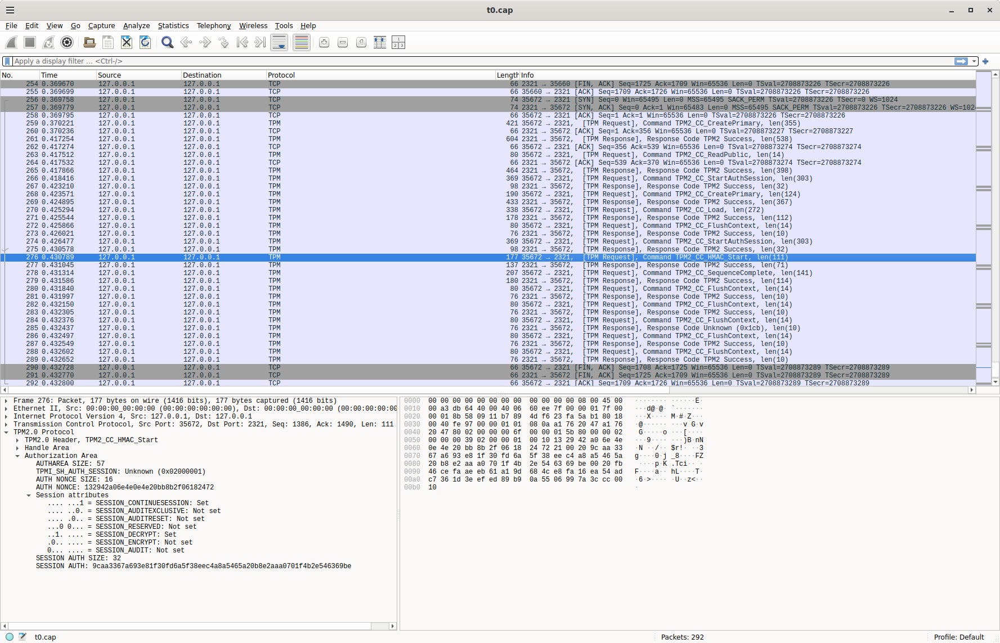
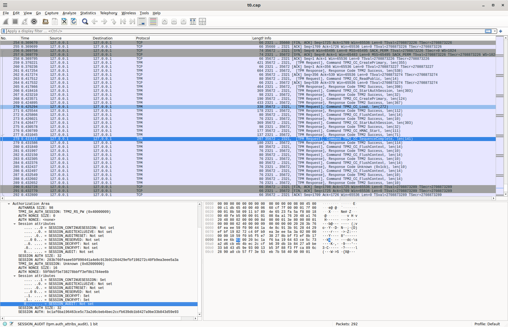

## TPM based Key Deriviation Function (KDF)


CLI and library which provides a `counter mode KDF` as described in [NIST SP 800-108](https://csrc.nist.gov/pubs/sp/800/108/r1/upd1/final).

This CLI utilizes an TPM-based HMAC key as a basis to derive the KDF.

Library basically overrides [Canonicals KDF](https://github.com/canonical/go-kbkdf) and has been verified against [NIST test vectors](https://csrc.nist.gov/Projects/Cryptographic-Algorithm-Validation-Program/Key-Derivation).

---

### References

* [Trusted Platform Module (TPM) recipes with tpm2_tools and go-tpm](https://github.com/salrashid123/tpm2)
* [golang-jwt for Trusted Platform Module (TPM)](https://github.com/salrashid123/golang-jwt-tpm)
* [tpm2 key utility](https://github.com/salrashid123/tpm2genkey)
* [ASN1 format for TPM keys](https://github.com/salrashid123/tpm2/tree/master/tpm-key)

---

### Parent Key

Currently, only the parent key represented by the [H2 Template](https://trustedcomputinggroup.org/wp-content/uploads/TCG_IWG_EKCredentialProfile_v2p4_r2_10feb2021.pdf) is supported.  This was done for compatibility with openssl (which by default only supports the `h2`)

The H2 template is also what is specified in [ASN.1 Specification for TPM 2.0 Key Files](https://www.hansenpartnership.com/draft-bottomley-tpm2-keys.html#name-parent)

Its possible to support other parent key types (`rsa_ek`, `ecc_ek`, `rsa_srk`, `ecc_srk`) but H2 is the easiest.  If you need other parent types, pls create an issue in github..

The following shows an example of creating the `h2 parent` and then an HMAC key on the TPM 

```bash
printf '\x00\x00' > unique.dat
tpm2_createprimary -C o -G ecc \
    -g sha256  -c primary.ctx -a "fixedtpm|fixedparent|sensitivedataorigin|userwithauth|noda|restricted|decrypt" -u unique.dat

tpm2_create -C primary.ctx -g sha256 -G hmac -u hmac-fixed.pub -r hmac-fixed.priv
tpm2_encodeobject -C primary.ctx -u hmac-fixed.pub -r hmac-fixed.priv -o tpm-key-fixed.pem
```

If you want to _import_ an external hmac key, the flow uses the same parent

```bash
echo -n "my_api_key" > hmac.key
hexkey=$(xxd -p -c 256 < hmac.key)

printf '\x00\x00' > unique.dat
tpm2_createprimary -C o -G ecc \
    -g sha256  -c primary.ctx -a "fixedtpm|fixedparent|sensitivedataorigin|userwithauth|noda|restricted|decrypt" -u unique.dat

tpm2_import -C primary.ctx -G hmac -i hmac.key -u hmac.pub -r hmac.priv
tpm2_load -C primary.ctx -u hmac.pub -r hmac.priv -c hmac.ctx
tpm2_encodeobject -C primary.ctx -u hmac.pub -r hmac.priv -o tpm-key.pem
```

### Library

As a library, you need to import Vault's base KDF class and override it with this libarary.

The following with derive a key from "foo":

```golang
import (
	"encoding/hex"
	tpmkdf "github.com/salrashid123/tpm-kdf"
)

	keyFileBytes, err := os.ReadFile("/path/to/tpm-key.pem")

	keyLengthBits := uint32(256)
	label := []byte("foo")
	context := []byte("context")

	prf, err := tpmkdf.NewTPMPRF("/dev/tpmrm0", nil, keyFileBytes, nil, nil, "")

	// Derive the key using the Counter Mode KDF
	derivedKey, err := tpmkdf.CounterModeKey(
		prf,           // The pseudorandom function (HMAC-SHA256)
		nil,           // The master secret key, set this to nil since its derived from the PRF
		label,         // Optional label
		context,       // Optional context
		keyLengthBits, // Desired key length in bits
	)

	fmt.Printf("Derived Key (%d bytes): %x\n", len(derivedKey), derivedKey)
```

The core accepts the following parameters:

```golang
func TPMKDF(
	tpmPath string, 
	rwc io.ReadWriteCloser, 
	pemkeyBytes []byte, 
	parentAuth []byte, 
	keyAuth []byte,
	sessionEncryptionName string,
	data []byte) (*tpmPrf, error) {
```

if you want the library to open and close the tpm for every call, specify the `tpmPath` (eg `tpmPath=/dev/tpmrm0`)

if you want to manage the TPM read closer externally, set `tpmPath` nil and set the `rwc` to a TPM

```golang
	rwc, err := tkdf.OpenTPM(*tpmPath)

	keyFileBytes, err := os.ReadFile("/path/to/tpm-key.pem")

	prf, err := tpmkdf.NewTPMPRF(nil, rwc, keyFileBytes, nil, nil, "")

	// Derive the key using the Counter Mode KDF
	derivedKey, err := tpmkdf.CounterModeKey(
		prf,           // The pseudorandom function (HMAC-SHA256)
		nil,           // The master secret key, set this to nil since its derived from the PRF
		label,         // Optional label
		context,       // Optional context
		keyLengthBits, // Desired key length in bits
	)

	fmt.Printf("Derived Key (%d bytes): %x\n", len(derivedKey), derivedKey)
```

### CLI

As a library, provide the PEM formatted TPM private key and the length of of the data to mac.

You can get the signed and attested binary on the `Releases` page

```bash
./tpm-kdf  --label=foo   --context=context  \
    --keyFile=example/certs/tpm-key.pem --length=256 --tpm-path="127.0.0.1:2321
```

| Option | Description |
|:------------|-------------|
| **`-tpmPath`** | Path to the TPM device (character device or a Unix socket). (default: `/dev/tpmrm0`) |
| **`-keyFile`** | Path to the PEM formatted KeyFile |
| **`-length`** | result size |
| **`-label`** | kdf label |
| **`-context`** | kdf context |
| **`-tpm-session-encrypt-with-name`** | hex encoded TPM object 'name' to use with an encrypted session|
| **`-outputBase64`** | output as base64 |

The `keyFile` parameter here accepts a PEM formatted key as described in [ASN.1 Specification for TPM 2.0 Key Files](https://www.hansenpartnership.com/draft-bottomley-tpm2-keys.html).

You can save a key in PEM format using [tpm2_encodeobject](https://github.com/tpm2-software/tpm2-tools/blob/master/man/tpm2_encodeobject.1.md) or [tpm2 key utility](https://github.com/salrashid123/tpm2genkey)

#### Setup

The following sets up a sofware TPM but you can ofcourse use the real thing.  

```bash
cd example/

# mkdir myvtpm
# swtpm_setup --tpmstate myvtpm --tpm2 --create-ek-cert

swtpm socket --tpmstate dir=myvtpm \
   --tpm2 --server type=tcp,port=2321 --ctrl type=tcp,port=2322 --flags not-need-init,startup-clear --log level=5

export TPM2TOOLS_TCTI="swtpm:port=2321"

### if you wanted to generate a new key, then run the following.
###  the example/ folder contains key files with this passphrase.

echo -n "my_api_key" > hmac.key
hexkey=$(xxd -p -c 256 < hmac.key)

printf '\x00\x00' > unique.dat
tpm2_createprimary -C o -G ecc \
    -g sha256  -c primary.ctx -a "fixedtpm|fixedparent|sensitivedataorigin|userwithauth|noda|restricted|decrypt" -u unique.dat

tpm2_import -C primary.ctx -G hmac -i hmac.key -u hmac.pub -r hmac.priv
tpm2_flushcontext -t && tpm2_flushcontext -s && tpm2_flushcontext -l
tpm2_load -C primary.ctx -u hmac.pub -r hmac.priv -c hmac.ctx
tpm2_encodeobject -C primary.ctx -u hmac.pub -r hmac.priv -o tpm-key.pem

go run cmd/main.go  --label=foo --context=context \
   --keyFile=example/certs/tpm-key.pem --length=256 --tpm-path="127.0.0.1:2321"
```

If you want to setup a key with auth, create an authsession and `policypassword` after the primary

```bash
# tpm2_startauthsession -S session.dat
# tpm2_policypassword -S session.dat -L policy.dat
# tpm2_flushcontext session.dat

# tpm2_import -C primary.ctx -G hmac -i hmac.key -u hmac.pub -r hmac.priv -L policy.dat -p testpswd
# tpm2_flushcontext -t && tpm2_flushcontext -s && tpm2_flushcontext -l
# tpm2_load -C primary.ctx -u hmac.pub -r hmac.priv -c hmac.ctx
# tpm2_encodeobject -C primary.ctx -u hmac.pub -r hmac.priv -o tpm-key.pem 
# tpm2_flushcontext -t && tpm2_flushcontext -s && tpm2_flushcontext -l

go run cmd/main.go  --label=foo  \
   --keyFile=example/certs_policy/tpm-key.pem --keyPass=testpswd --length=256 --tpm-path="127.0.0.1:2321"
```

THe current release only uses passwordAuth.  

Other policy times can get encoded into the TPM but i'm just waiting for the  specs to finalize.  For now, see [Reconstruct Policy using command parameters](https://github.com/salrashid123/tpm2/tree/master/policy_gen)


### Encrypted TPM Sessions

If you want to enable [TPM Encrypted sessions](https://github.com/salrashid123/tpm2/tree/master/tpm_encrypted_session), you should provide the "name" of a trusted key on the TPM for each call.

A trusted key can only be the `RSA-EK` Key. You can get the name using `tpm2_tools`:

```bash
tpm2_createek -c ekprimary.ctx -G rsa -u ek.pub -Q
tpm2_readpublic -c ekprimary.ctx -o ek.pem -n name.bin -f pem -Q
xxd -p -c 100 name.bin 
  000b84c403b83cdf6472d9e84f87169cac746be95c1182ed61bffd12f18adaea8e63
```

Then use the hex value returned in the `--tpm-session-encrypt-with-name=` argument.

For example:

```bash
   --tpm-session-encrypt-with-name=000b84c403b83cdf6472d9e84f87169cac746be95c1182ed61bffd12f18adaea8e63

# for example
 go run policy/main.go \
    --tpm-session-encrypt-with-name=000b84c403b83cdf6472d9e84f87169cac746be95c1182ed61bffd12f18adaea8e63
```

For example, most TPM calls are encrypted.

start



complete



If you do *not* specify an encryption name, the default `rsa-ek` is recalled and used anyway.

### Latency

Its certainly expected that there is significant latency in the KDF generation for keys (proportional to the number of hmac calls are made)

In an unscientific test, the TPM based operations has far larger latency:

```bash
$ time ./counter/main 
Derived Key (32 bytes): aa8c90530bb6c6e3e7d9047dfe4bd750c4c0c7a6206e4b75905a62a27b479333

real	0m0.443s
user	0m0.050s
sys	0m0.028s

$ time ./baseline/main 
Derived Key (32 bytes): aa8c90530bb6c6e3e7d9047dfe4bd750c4c0c7a6206e4b75905a62a27b479333

real	0m0.031s
user	0m0.012s
sys	0m0.023s
```

### Testing

Using [swtpm](https://github.com/stefanberger/swtpm)

```bash
rm -rf /tmp/myvtpm && mkdir /tmp/myvtpm
swtpm_setup --tpmstate /tmp/myvtpm --tpm2 --create-ek-cert
swtpm socket --tpmstate dir=/tmp/myvtpm --tpm2 --server type=tcp,port=2321 --ctrl type=tcp,port=2322 --flags not-need-init,startup-clear

# then specify "127.0.0.1:2321"  as the TPM device path in the examples
# and for tpm2_tools, export the following var
export TPM2TOOLS_TCTI="swtpm:port=2321"

go test -v
```

You can also verify using canonical's default library and with python:

```bash
$ go run counter/main.go 
Derived Key (32 bytes): aa8c90530bb6c6e3e7d9047dfe4bd750c4c0c7a6206e4b75905a62a27b479333

$ go run baseline/main.go 
Derived Key (32 bytes): aa8c90530bb6c6e3e7d9047dfe4bd750c4c0c7a6206e4b75905a62a27b479333

$ python3 baseline/kdf.py 
aa8c90530bb6c6e3e7d9047dfe4bd750c4c0c7a6206e4b75905a62a27b479333
